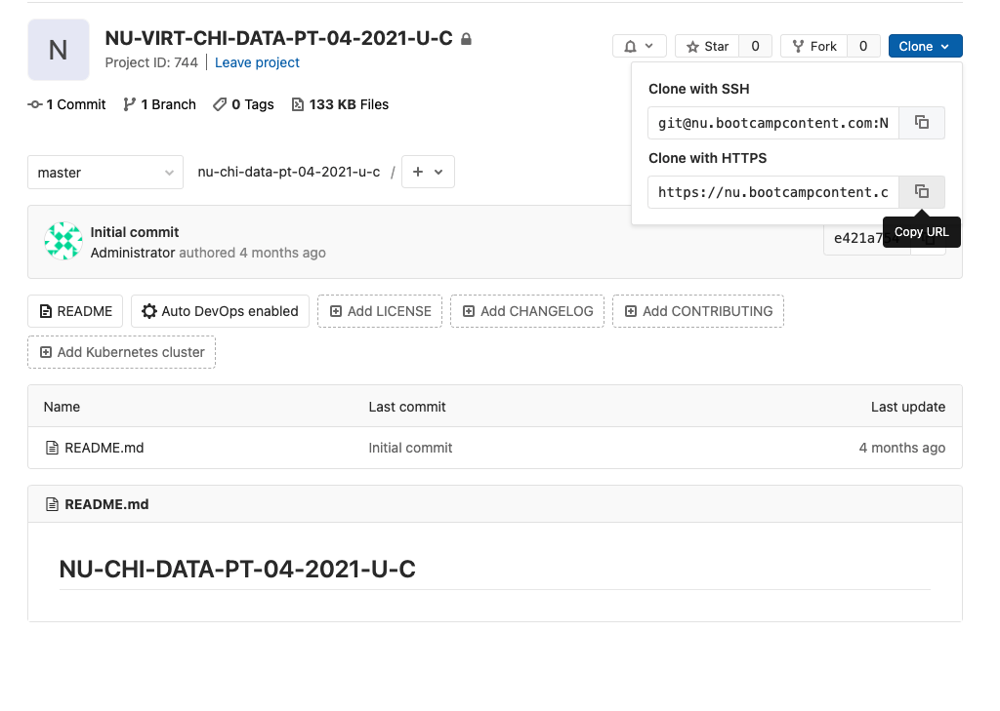

# Git for the Class Repo

What the difference between Github and Gitlab? They are basically two companies that do the same thing. The class repository is hosted on Gitlab. The pre-work had you set up a Github account, because you will be using it to submit homework in the future.

## 1 Clone the repository

You will only need to clone the repo **one time**. 

### 1.1 Navigate to Desired Folder

Navigate in Terminal or Gitbash to the folder that you would like to keep the class repo. You can refer to the "What is Terminal?" section of the pre-work or google "command line cheat sheet." For this example I will create a new folder in my documents folder called bootcamp. The class repo will appear as another folder in the bootcamp folder. The $ in the following example is just convention to show that these are used on the command line, so you just type what's after the $. 

`$ cd ~` 

`$ cd Documents`

`$ mkdir bootcamp`

`$ cd bootcamp`

### 1.2 Get the Gitlab Address

Before using the git command to clone the repo, you will need the URL the repo. 

If you want to use the SSH key you set up during the pre-work, your key needs to be added to Gitlab. It's the same process as it was for Github. If you haven't set that up, the HTTPS method is easier. 

Login to the class repository in Gitlab. You should see a blue button that says "Clone". Click it and copy the URL. 

### 1.3 Clone Command

Head back to Terminal or Gitbash. Use the follow command and paste the URL you just copied.

`$ git clone <gitlab url>`  e.i. 'git clone https://nu.bootc...'

If you use the HTTPS method, you will be prompted to input your Gitlab credentials. 

If all went well, it will begin to download the files. If it fails, your credentials are probably wrong. Retry the git clone command. However, your machine may have saved your false credentials, so you will need to find those and delete them. 

Now that you have cloned the class repository, you can use finder or file explorer to look at what's in the repo.

## 2 Update the Repo

You will only need to clone the repo once. However we will be adding new material to the repo before every class. Getting the new material on your machine is a pretty simple task.

### 2.1 Navigate to Your Repo

Before doing a git pull navigate to the repo using Terminal or Gitbash. For the example that I did above in the clone section, I would do the following.

`$ cd ~` 

`$ cd Documents`

`$ cd bootcamp`

`$ cd nu-chi-data-pt-04-2021-u-c`

**Protip** - Tab is your friend. Use the Tab button to auto-complete.

I can type 'cd nu' and then hit tab and it will fill in the rest.

### 2.2 Git Pull

To get all the latest material on your personal machine, you will need to do a git pull. Once you navigate to somewhere in your repo using Terminal or Gitbash, use the following command.

`$ git pull`

And that's it. You will see it download all the new material.  

Technically what this does is it downloads all the 'commits' that were made on the remote repository on Gitlab and then sets the 'head' of your personal repository to the latest 'commit'. We will explore this some more later.

 

